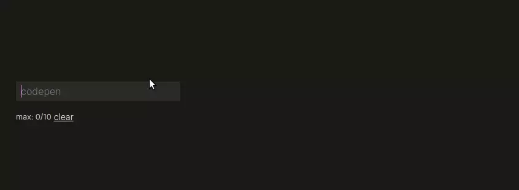

## Features :pen:

- Choose your own **autocomplete** words!
- Set a **maximum** number of chips!

## Roadmap :car:

- [x] We should add **autocomplete** :pencil:

- [ ] Use Vue **Testing** to make it more stable. 👨‍🔬️

- [ ] `<datalist>` is removed when the device is mobile, so we should provide mobile users with a substitute.